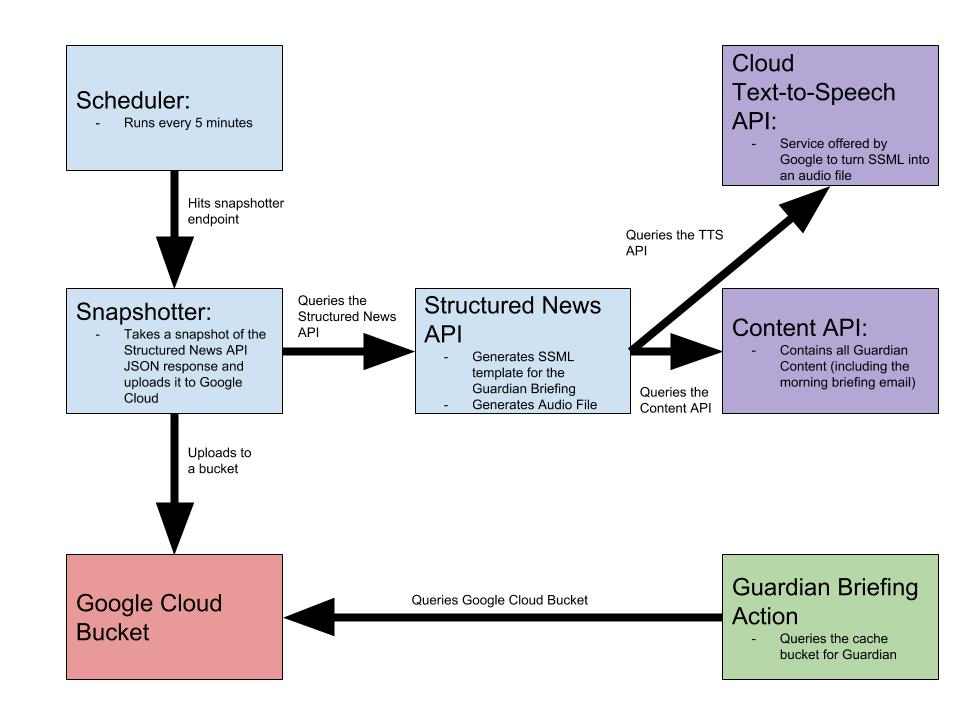

# Guardian Briefing

This project contains two firebase functions. Both these functions work together to power the Guardian Briefing Action. [Blog post](https://www.theguardian.com/info/2019/mar/06/guardian-news-google-assistant-briefing) on the launch.

## Guardian Briefing Function

This function powers the Guardian Briefing Action. It gets a cached version of the [structured-news-api](https://github.com/guardian/structured-news-api) that has been uploaded to a Google Cloud Storage bucket. It serves different content to the user based on locale. There are 3 versions of the briefing available as the [structured-news-api](https://github.com/guardian/structured-news-api) supports three briefings, a US version an Australian briefing and a UK briefing. The locale switching logic is in [localUtils.ts](./functions/src/localUtils.ts).

The Briefing serves an audio file that has been generated by the Structured News API and the stories that make up the briefing are served as a `Browse Carousel`.

There is a [zip file](Guardian-Briefin.zip) for restoring the Dialogflow part of the Action.

## Snapshotter Function:

This function runs every 5 minutes using Google Cloud Scheduler. It calls the [structured-news-api](https://github.com/guardian/structured-news-api) and uploads the JSON response to a Google Cloud Storage Bucket. This is so the Guardian Briefing Function can use this cached version of the SNAPI (structured news API) response.

This is good because:

1. It's faster
2. It stops the audio file the briefing function uses being generated every time a user uses the Guardian Briefing.

### API Parameters for Snapshotter

#### locale: Snapshotter can take snapshots of news templates for the UK, US and Australia.

Params:

- 'en-AU' : snapshots the Australian focused briefing
- 'en-CA' & 'en-US' : snapshots the US focused briefing
- all other values including 'en-GB', 'en-IN', 'en-SG' and when no locale is provided: snapshots the UK focused briefing

# Set Up

- You need permission to access the google cloud project
- You need the [firebase cli](https://github.com/firebase/firebase-tools) installed
- You need to log in to firebase using `firebase login`
- You need to run `yarn install` from inside the `functions` directory
- You need to set up environnement variables
- You need to have service account credentials locally

## Environment Variables

This project requires environment variables. Run `firebase functions:config:get > .runtimeconfig.json` in the `functions` directory to run the function locally.

# Service Account Credentials

The app also requires a service account ID.

1. Go to the Google Cloud Console for the project
2. Go to IAM & Admin
3. Go to Service Accounts
4. Select the file-upload account and select 'create key'. This will download a key onto your machine.
5. In terminal type `export GOOGLE_APPLICATION_CREDENTIALS=path_to_json_file_containing_key`

## Run locally

`yarn valid` will run the TypeScipt build step, the linter and all tests.

`yarn test` will run all tests.

[Blog post](https://www.theguardian.com/info/2019/jan/31/hey-google-help-me-use-cloud-functions) on firebase functions locally.

From inside the `functions` directory run `yarn serve`. This will run both functions and provide local endpoints that can be curled.

Snapshotter will be available at [http://localhost:5000/guardian-briefing-84558/us-central1/generateBriefing](http://localhost:5000/guardian-briefing-84558/us-central1/generateBriefing). However it will still be uploading to the PROD infrastructure.

The Briefing function will be available at [http://localhost:5000/guardian-briefing-84558/us-central1/guardianBriefing](http://localhost:5000/guardian-briefing-84558/us-central1/guardianBriefing).

### POST to the Briefing Function

Using the Briefing Function locally is more involved than the Snapshotter as it requires a blob of JSON which has many fields. You will need to construct some JSON to pass to the function. The shape of this JSON is documented [here](https://developers.google.com/actions/build/json/dialogflow-webhook-json). You can also get an example of some JSON by going to the [simulator](https://console.actions.google.com/project/year-in-review-138f5/simulator) then going to the 'Request' tab.

Example:

```
# This assumes a file called data.json where the json is the correct shape.
yarn shell
const data = require('./data.json')
guardianBriefing.post().form(data)
```

Alternatively the JSON can be POSTed directly to the local endpoint generated by running `yarn serve'.

## Deploy:

From inside the `functions` directory run `yarn deploy`. This will deploy both functions to PROD

`yarn deploySnapshotter` only deploys the Snapshotter function.

`yarn deployBriefing` only deploys the Briefing function.

These all deploy the project to PROD. Any changes that need to be made to the Dialogflow parts of the project need to done in the Dialogflow [console](https://console.dialogflow.com) (this only applies to the Guardian Briefing function).

The deploy steps are outlined in the [firebase.json](./firebase.json) file and the default project ID is defined in [.firebaserc](./.firebaserc).

# Infrastructure



## Guardian Specific Information

Guardian specific information about the project is available [here](https://github.com/guardian/voicelab-platform) in a private repo.
